# CLion Setup
This is the step-by-step instructions of how to set up your CLion environment for ECE 17.

This setup will be done for the Windows OS, but the steps should remain relatively the same for other operating systems.
## Installation
**Note**: If you already have a JetBrains student pack, navigate to the CLion page and start on step 3.
1. Navigate to this [link](https://www.jetbrains.com/) and register for an account.
2. After verifying your status as a student, you should see this screen
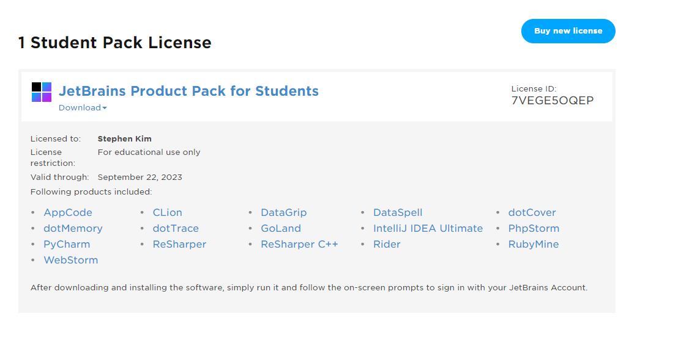
Click on the CLion link and you should arrive on this screen
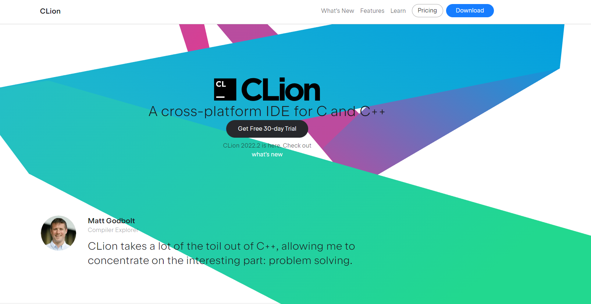
3. Click on the download button and click on Download and .exe (For Windows users only, Mac should use .dmg)
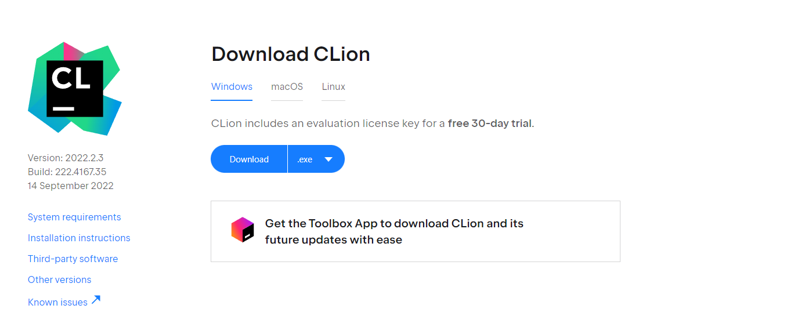
4. Run the installer for CLion and the setup wizard should open up
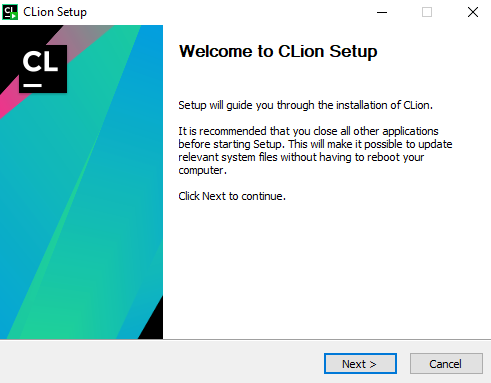
5. Select **Next** and choose where to install the applications (The default location should be fine)
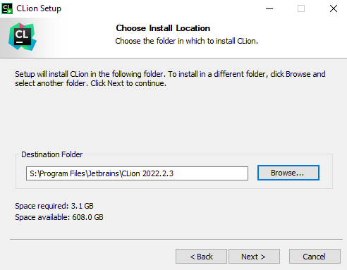
6. Next you'll be asked what preferences you want (These are all optional, they mainly wil help you access files through CLion instead of default applications like Notepad)
- Create Desktop Shortcut: Creates a shortcut icon on the desktop
- Update Context Menu: When you right click a file, it will show open with CLion
- Create Assocations: When you double click a file, it will open with CLion for the specified files types (ex. .c, .h, etc)  
Below are the ones I recommend
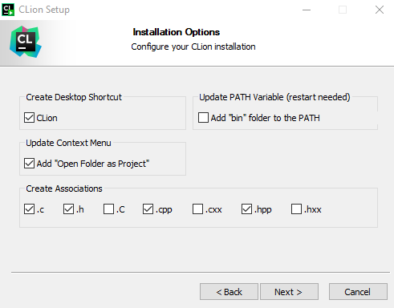
7. Next you'll be asked to choose a Start Menu Folder, the default is fine, so just click install and CLion should begin installing  
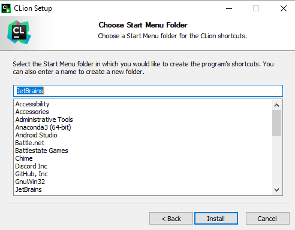
8. CLion should be successfully installed now 
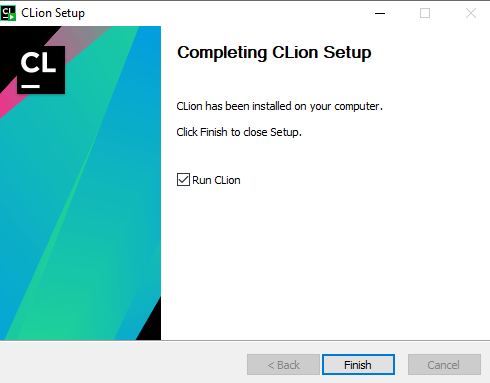
## First Time Set up (Hello World)
1. When you open CLion for the first time, you'll be met with this popup
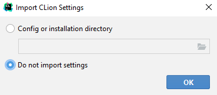  
This is just to import your styling settings, which you can if you have, but in most cases, you should choose do not import
2. Since there are no projects currently open, CLion will show the default screen given that you already have logged in
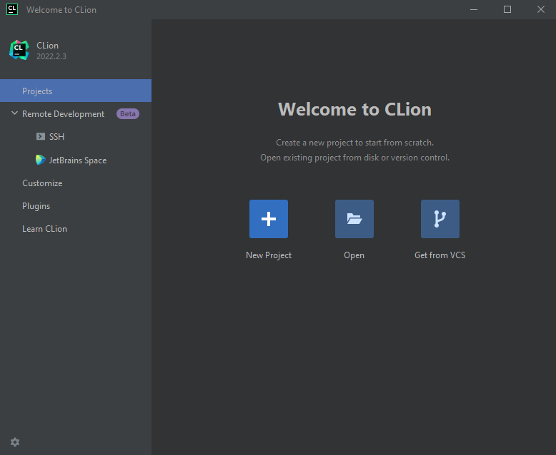  
If you have not logged in yet, you'll be met with this screen
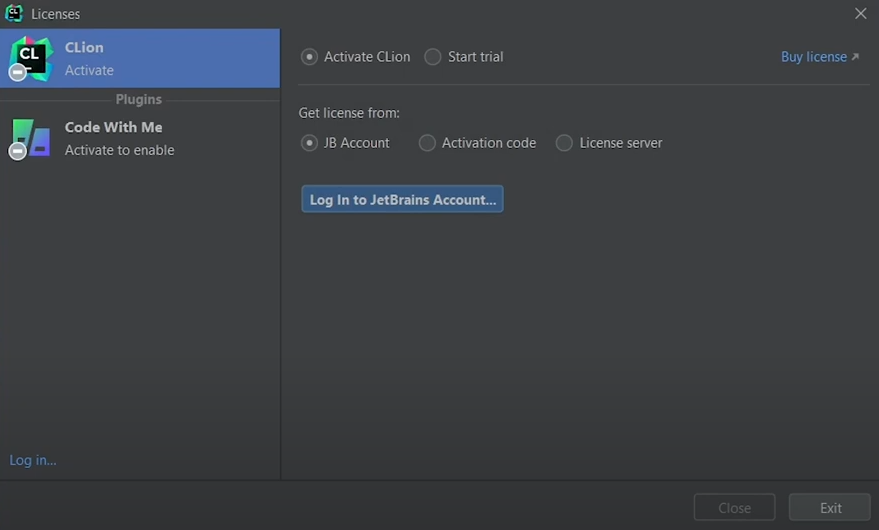  
Log in using you JB (JetBrains) account that you created earlier and you should have access to CLion now.
For our first CLion program, we can create a new project (I'll call this one HelloWorld)
Make sure that we are create a C++ executable and that we are using C++17
**Note**: For this class, we will be using C++17. It may not affect anything early on, but later, your code will not be able to compile if you are not using C++17.
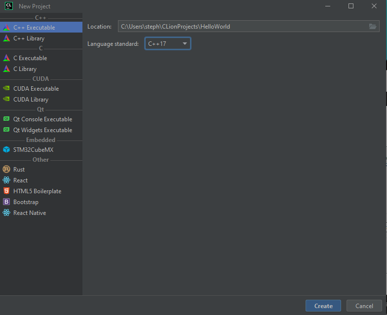  
3. After creating your project, the Open Project Wizard will pop up because we do not have a toolchain set up yet. A toolchain is a set of tools that essentially helps us build your code. Included are often a compiler, linker, and assembler. Other toolchains may have more, but that are the basics.
It may look like this
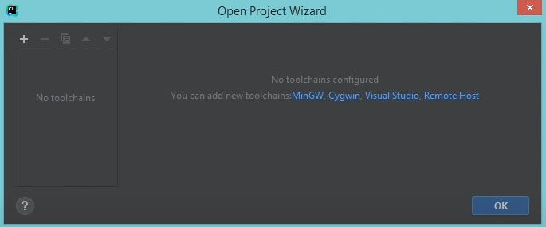  
Or look like this
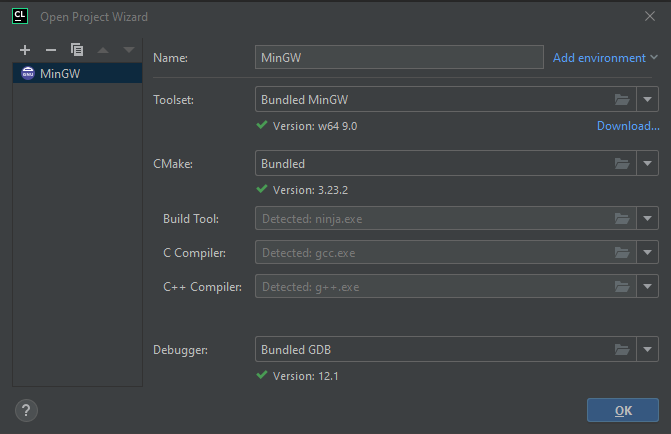  
4. You are free to install any toolchain you want, but the recommendations are Cygwin (recommended by the professor) and MinGW (recommended by me).
Since I use MinGW, we will be following the steps to install MinGW here.
5. Navigate to this [link](https://sourceforge.net/projects/mingw/) and click the green Download button to install the MinGW installer
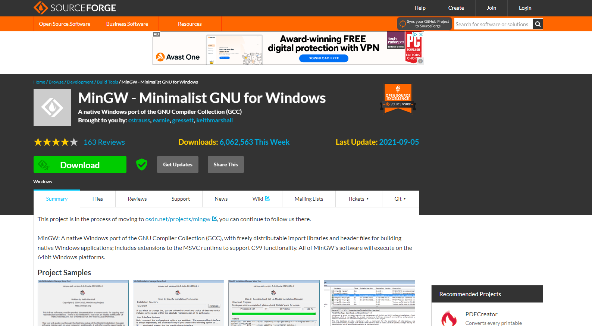  
6. Run the installer
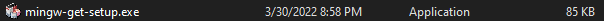  
  
7. Any location is fine (Be sure to remember where you install it)
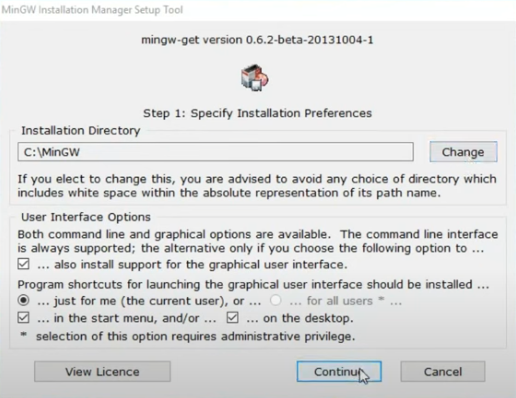
8. After installing, choose the following packages to install
- mingw-developer-tool
- mingw32-base
- mingw32-gcc-g++
- msys-base
9. In the top left, select Installation followed by Apply Changes
10. After the installation is completed  
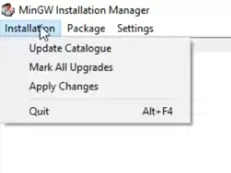
11. Now go back to CLion and Select the MinGW toolset (I saved mine in C:\MinGW)
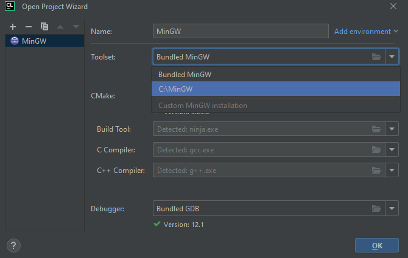
Hopefully, everything is detected (build tool, C compiler, C++ compiler)

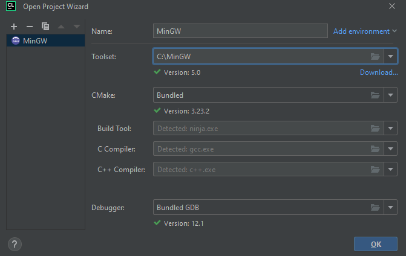
And Click OK
12. Now you should see about this screen
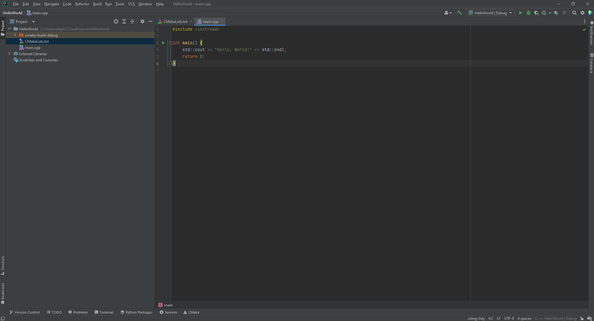
Clicking the green play button on the top right will run the program and the program output will show below as "Hello World"
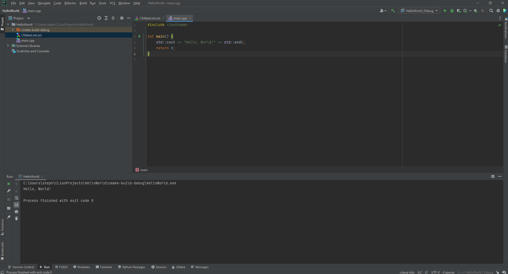