# Git Setup
This is the step-by-step instructions of how to set up Git for the command line.

This setup will be done for the Windows OS, but the steps should remain relatively the same for other operating systems.

Using commands on the terminal makes me feel really cool and smart, but it is not as user-friendly as the GUI for Git through Github Desktop. If you feel up to it, follow along and use the command line, otherwise, there's no harm is using the tools someone else built to make our lives as developers easier.
## Installation
**Note**: This guide is for installing the git for command-line usage.
1. Navigate to this [link](https://git-scm.com/downloads) and click on your operating system followed by the download button  
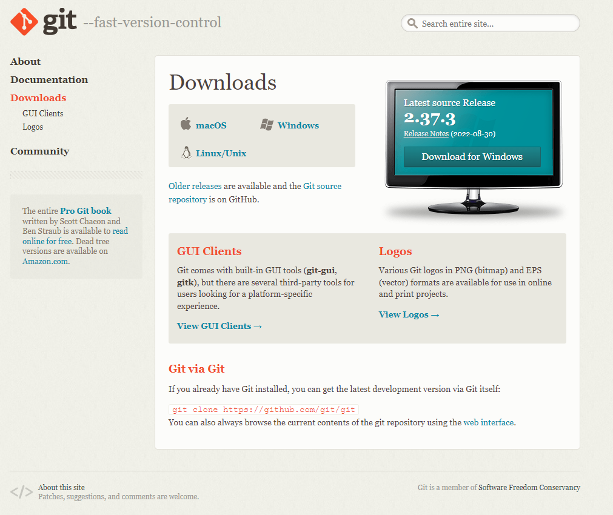
2. For Windows, you want to choose whichever bit (32 or 64) your computer is operating at.  
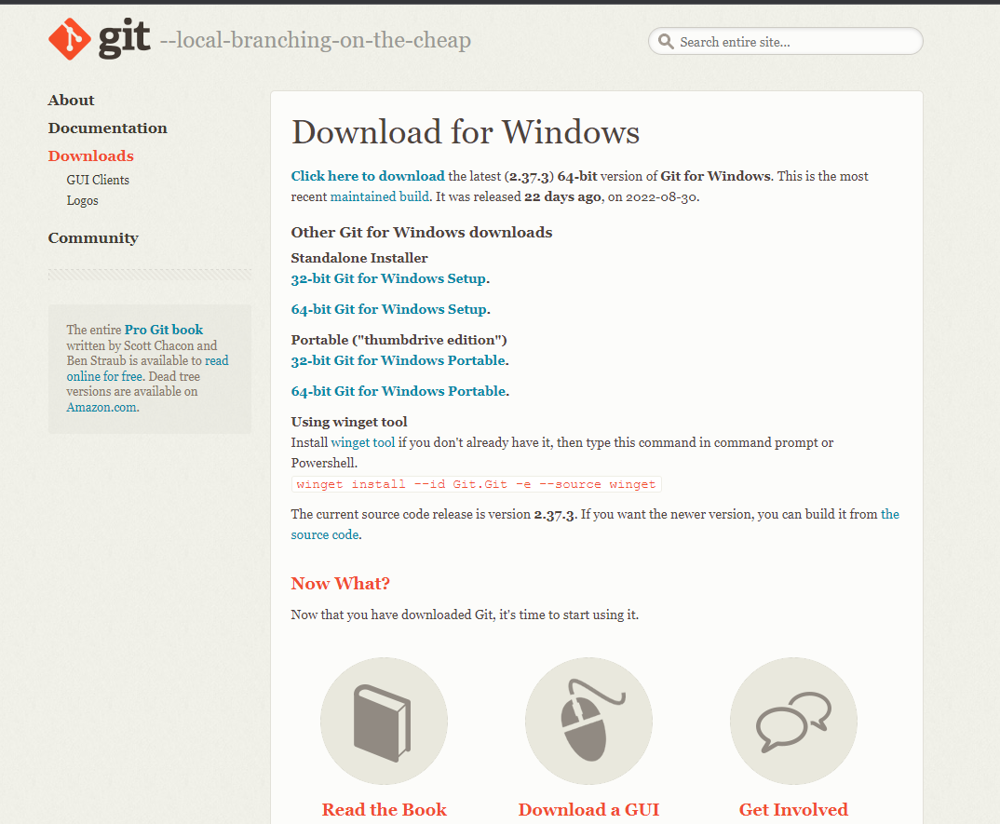
3. Run the installer  
4. Accept the license  
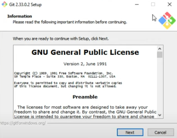
5. Choose an installation location  
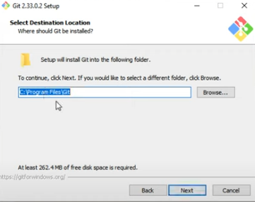
6. Leave the checkboxes as default  
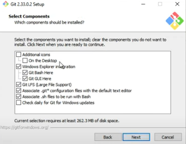
7. Choose a Start Menu Folder (Default is fine)  
8. Choose let Git decide (shouldn't matter though)  
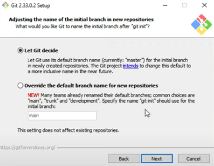
9. Choose Git from the command line  

10. Choose Use bundled OpenSSH  
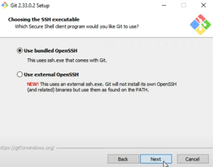
11. Choose Use the OpenSSL Library  
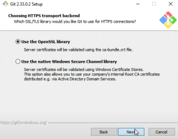
12. Choose Checkout Windows-Style  
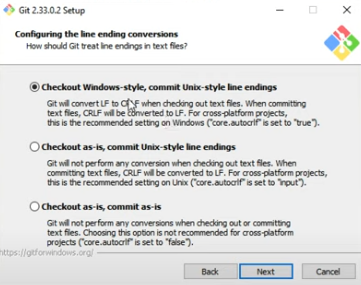
13. Choose Use Windowes' default console window  
14. Choose Default  
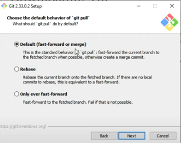
15. Choose Git Credential Manager Core  
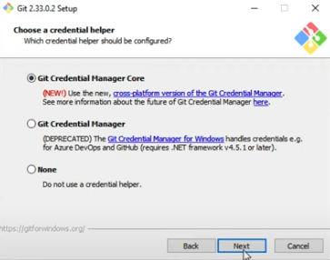
16. Choose Enable file system caching  
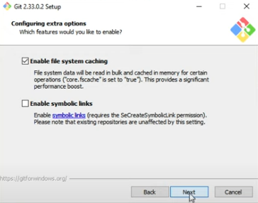
17. Select none  
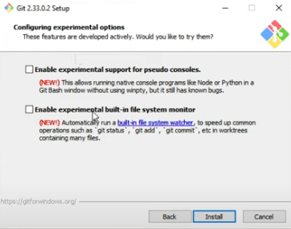
18. Install and all should be finished. You can open up PowerShell, cmd, MinTTY, or any terminal and type in **git** and you should see a similar result if all was installed successfully.  
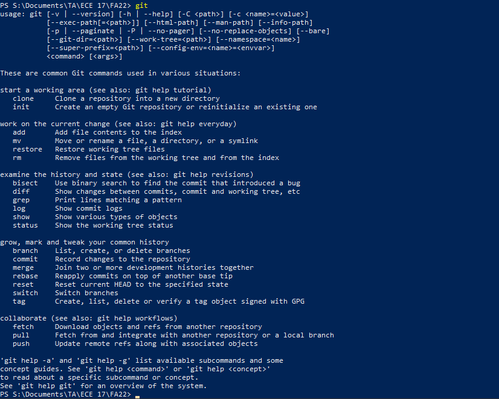
## Usage
Let's use Github desktop to add a repository to your local computer and add a change.  
1. Go to the repository on github.com  
2. Click the green Code button and copy the HTTPS link (You can use the two square button)
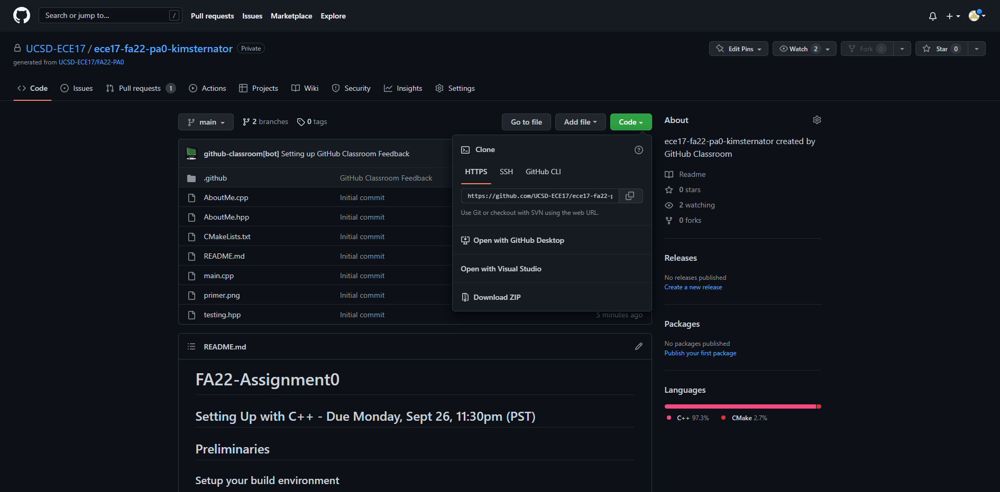
3. Navigate on the command line to the desired location and use the command __git clone {}__ and replace the {} with the URL you copied  
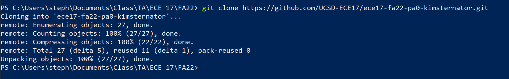
4. After making a change you can use the command __git status__ to see which files have been added/deleted or changed  
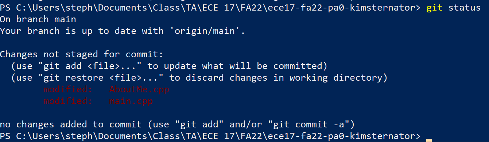
5. You can see the differences you have made with the command __git diff__ (I won't show the difference since it has PA0 answers)  
6. In order to make changes, first we have to add them to the commit using the command __git add {}__ where {} is replaced by the file/folder names. If we want to add all the files we can use the command __git add --all__. Running __git status__ again we can see that the files we added show up green.
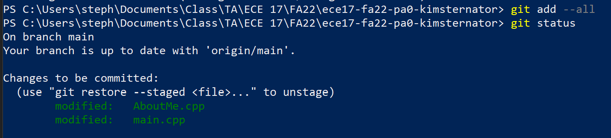
7. Next we must commit them using the command __git commit -m "{}"__ where {} is replaced with any message  
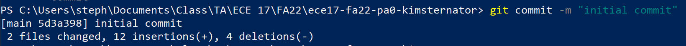
8. Now, we're ready to push using the command __git push__. This will put our local changes on the github repository and for our HW, the autograder will run  
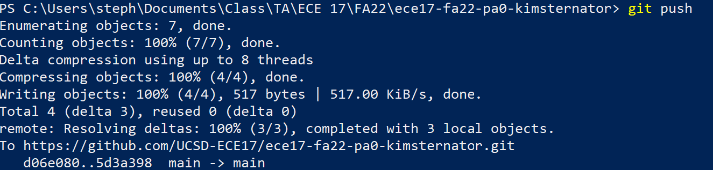