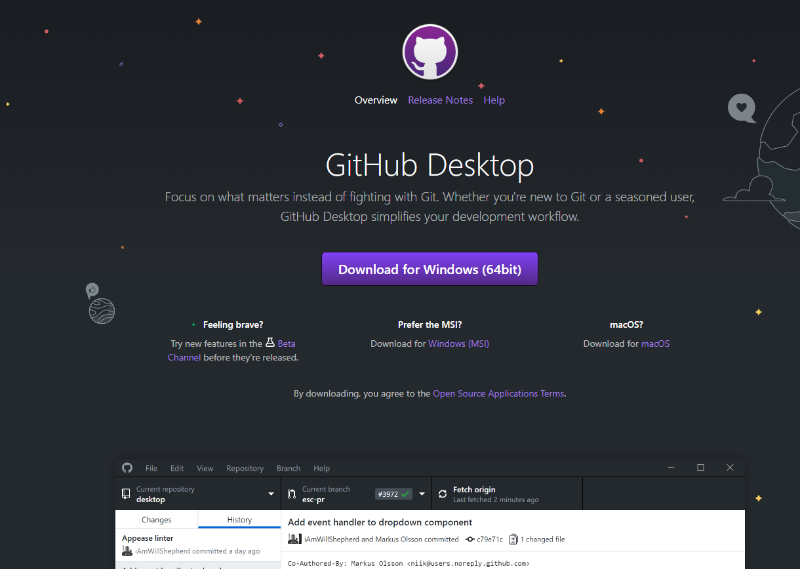

# Github Desktop Setup
This is the step-by-step instructions of how to set Github Desktop.

This setup will be done for the Windows OS, but the steps should remain relatively the same for other operating systems.
## Installation
1. Navigate to this [link](https://desktop.github.com/) and Click on Download (The text may be different depending on your operating system)  

2. Github Desktop will install once you run the download  

3. Log in to Github  

3. Github desktop is installed and ready to use