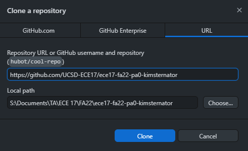
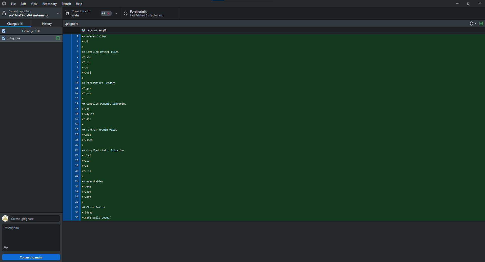
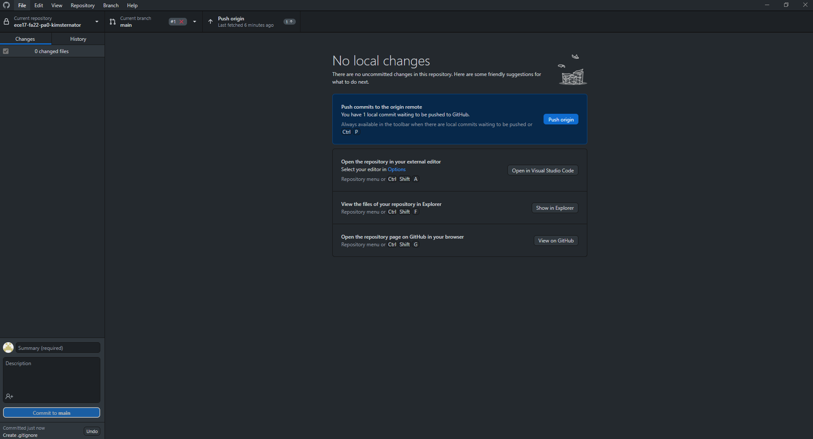

# Github Desktop Setup
This is the step-by-step instructions of how to set Github Desktop.

This setup will be done for the Windows OS, but the steps should remain relatively the same for other operating systems.
## Installation
1. Navigate to this [link](https://desktop.github.com/) and Click on Download (The text may be different depending on your operating system)  

2. Github Desktop will install once you run the download  

3. Log in to Github  

3. Github desktop is installed and ready to use
## Usage
Let's use Github desktop to add a repository to your local computer and add a change.  
1. Go to the repository on github.com  
2. Click the green Code button followed by Open with GitHub Desktop  

3. Choose where you want to save the repository and hit Clone  

4. After you make a change to a file in your local repository, the difference will show in Github Desktop   

5. Add a message (it can be anything) in the lower left and then click Commit  
6. The last step is to push, which is the button in the middle  

7. There is now a change in your HW repository and the autograder will now run